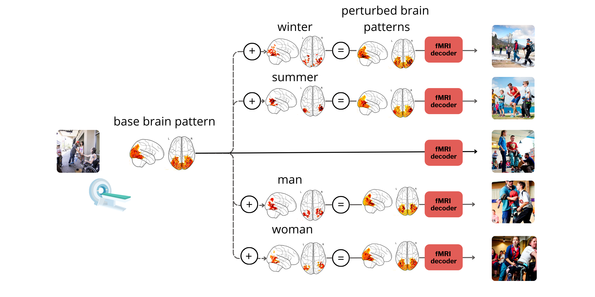
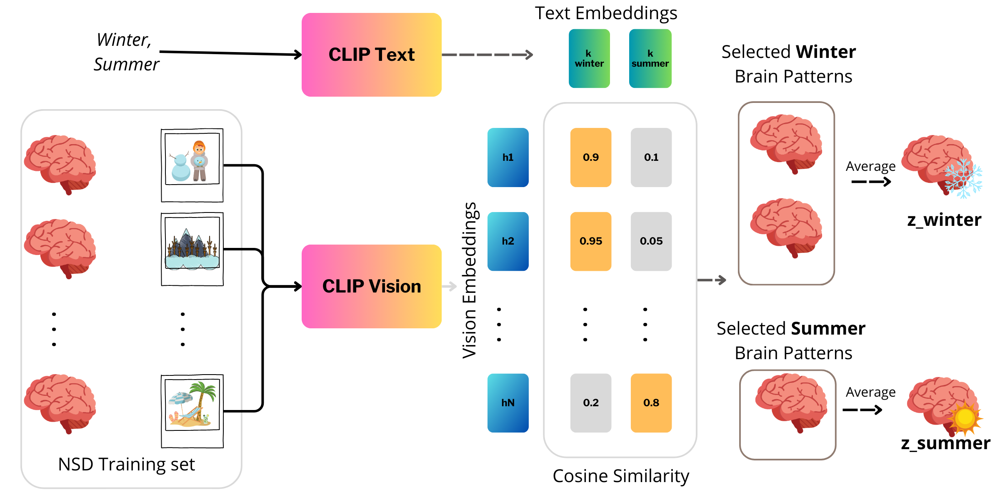
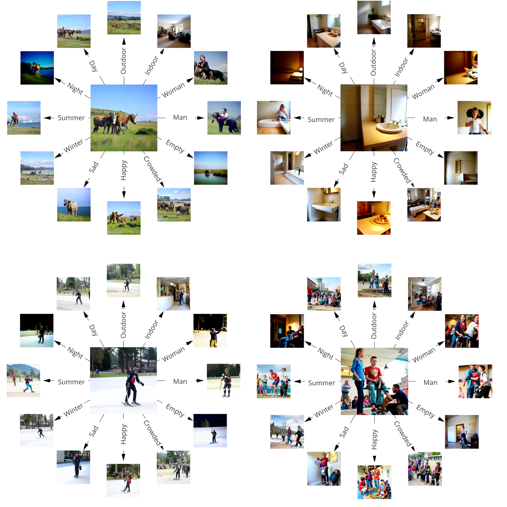

# 🧠 Brain Algebra: Evidence for compositionality in fMRI visual representations

---

**Abstract**
Electrophysiological and neuroimaging studies have revealed how the brain encodes various visual categories and concepts. An open question is how combinations of multiple visual concepts are represented in terms of the component brain patterns: are brain responses to individual concepts composed according to algebraic rules?

To explore this, we generated "conceptual perturbations" in neural space by averaging fMRI responses to images with a shared concept (e.g., "winter" or "summer"). After thresholding to ensure specificity, we applied these perturbations to the neural pattern associated with a base image, forming new brain patterns that incorporate the added concept. These modified brain patterns were then decoded into images using a pretrained fMRI-to-image decoding model.

Qualitative and quantitative inspection of the resulting images provides insight into how the brain might combine visual concepts. For example, adding a "winter" perturbation to the brain pattern of a man on a skateboard yields a new pattern representing a man on a snowboard in a winter scene—even when the perturbation modifies only a small subset of voxels. Our findings reveal that compositional processes in neural representations may lead to predictable perceptual outcomes, as interpreted by our decoding model. This suggests that the brain’s combinatory encoding of concepts may follow a systematic, algebraic-like process—what we term "brain algebra." Although our study is model-driven, it opens avenues for future empirical work into the mechanisms of compositionality in the brain.

---

## 📦 Data Access

You can request and download the data from:

* 🧠 **NSD Dataset**: [https://naturalscenesdataset.org/](https://naturalscenesdataset.org/)
* 🐍 Use the Python scripts `download_nsddata.py` and `prepare_nsddata_captions.py`, adapted from the [BrainDiffuser repo](https://github.com/ozcelikfu/brain-diffuser/tree/671f1403fe2a0515771c29d64fb839153cf12f5e)

You'll also need:

* 🖼️ **COCO Captions (2017 split)**: [https://cocodataset.org/#home](https://cocodataset.org/#home)
* 📥 Download VDVAE weights and fMRI data following the setup steps in the BrainDiffuser repository

---

## 🧪 Method Overview & Qualitative Results

Below are example visualizations showing how brain representations can be algebraically perturbed:

### 🧩 Method Scheme

### ➕ Conceptual Perturbation

### 🎯 Output Examples

---

## 🚀 How to Use This Repository

1. 📥 **Download the data** (fMRI + captions + VDVAE checkpoints)
2. 🧠 **Train the Brain-Diffuser model** using the code in `decoding.py` (for each subject)
3. 🧪 **Apply perturbations** by running `BrainAlgebra_SingleConcept.ipynb`
   ✏️ Don’t forget to edit file paths to point to your own directories.

---

## 📚 References

* 🧠 **BrainDiffusers code**: [Ozcelik et al.](https://github.com/ozcelikfu/brain-diffuser/tree/671f1403fe2a0515771c29d64fb839153cf12f5e)
* 🧬 **OpenAI VDVAE**: [https://github.com/openai/vdvae](https://github.com/openai/vdvae)
* 🌄 **NSD Dataset**: [https://naturalscenesdataset.org/](https://naturalscenesdataset.org/)

